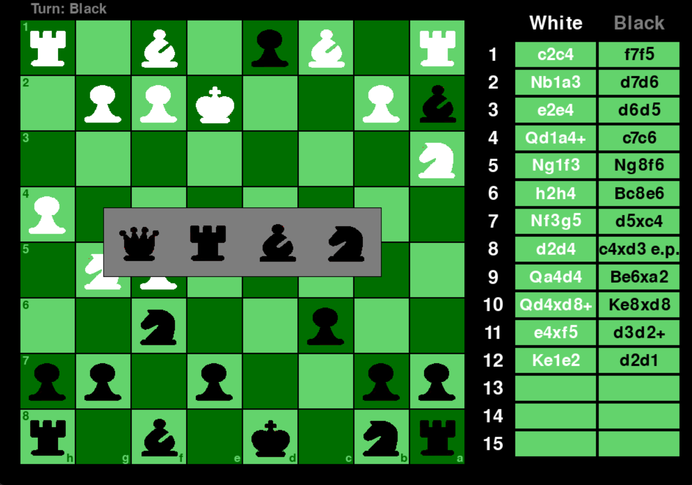

# 簡易西洋棋遊戲

<a href="./README.md">English</a> | <a href="./README.zh-TW.md">繁體中文</a>


一個使用 Python 3.12.9 並搭配 Pygame 套件實作的簡易西洋棋遊戲。  
> 此專案的主要目的，是透過撰寫小型遊戲來熟悉 Python 語言及 Pygame 套件的開發流程。

## 遊戲畫面
&nbsp;&nbsp;&nbsp;&nbsp;&nbsp;&nbsp;&nbsp;&nbsp;&nbsp;&nbsp;&nbsp;&nbsp;&nbsp;&nbsp;&nbsp;&nbsp;初始畫面&nbsp;&nbsp;&nbsp;&nbsp;&nbsp;&nbsp;&nbsp;&nbsp;&nbsp;&nbsp;&nbsp;&nbsp;&nbsp;&nbsp;&nbsp;&nbsp;&nbsp;&nbsp;&nbsp;&nbsp;&nbsp;&nbsp;&nbsp;&nbsp;&nbsp;&nbsp;&nbsp;&nbsp;&nbsp;&nbsp;&nbsp;移動選擇   


&nbsp;&nbsp;&nbsp;&nbsp;&nbsp;&nbsp;&nbsp;&nbsp;&nbsp;&nbsp;&nbsp;&nbsp;&nbsp;&nbsp;&nbsp;&nbsp;升變面板&nbsp;&nbsp;&nbsp;&nbsp;&nbsp;&nbsp;&nbsp;&nbsp;&nbsp;&nbsp;&nbsp;&nbsp;&nbsp;&nbsp;&nbsp;&nbsp;&nbsp;&nbsp;&nbsp;&nbsp;&nbsp;&nbsp;&nbsp;&nbsp;&nbsp;&nbsp;&nbsp;&nbsp;&nbsp;&nbsp;&nbsp;結束面板   



## 執行環境
* Python 版本：`3.12.9`
* 套件管理器：`conda` / `pip`

## 如何遊玩
1. 創建 Python 3.12 虛擬環境並安裝相關套件
    ```bash
    conda create -n <venv> python=3.12
    conda activate <venv>
    pip install -r requirements.txt
    ```
2. 執行主程式
    ```bash
    # 執行 GUI 版本
    python gui_main.py

    # 執行 CLI 版本
    python cli_main.py
    ```
## 待實現的功能
* [x] 將死檢查。
* [ ] 和棋檢查：尚未實作和局規則（如 50 步和局、逼和等）。
* [x] 棋譜記錄。
* [x] 顯示所吃棋子。

如若有空，再補上述所遺漏之功能。