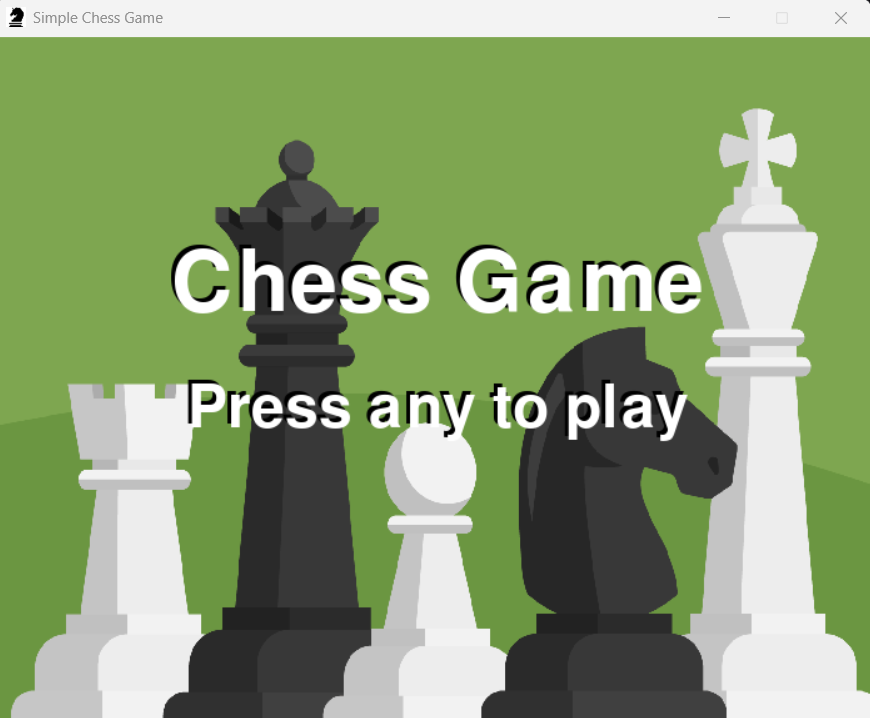
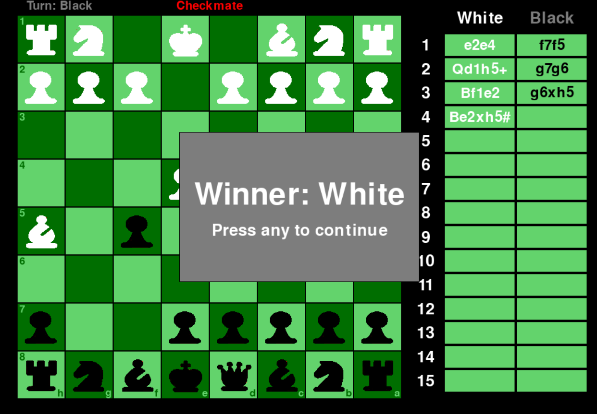

# 簡易西洋棋遊戲

<a href="./README.md">English</a> | <a href="./README.zh-TW.md">繁體中文</a>


一個使用 Python 3.12.9 並搭配 Pygame 套件實作的簡易西洋棋遊戲。  
> 此專案的主要目的，是透過撰寫小型遊戲來熟悉 Python 語言及 Pygame 套件的開發流程。

## 遊戲畫面
&nbsp;&nbsp;&nbsp;&nbsp;&nbsp;&nbsp;&nbsp;&nbsp;&nbsp;&nbsp;&nbsp;&nbsp;&nbsp;&nbsp;&nbsp;&nbsp;&nbsp;&nbsp;&nbsp;&nbsp;初始畫面   



&nbsp;&nbsp;&nbsp;&nbsp;&nbsp;&nbsp;&nbsp;&nbsp;&nbsp;&nbsp;&nbsp;&nbsp;&nbsp;&nbsp;&nbsp;&nbsp;&nbsp;&nbsp;&nbsp;&nbsp;&nbsp;&nbsp;&nbsp;&nbsp;&nbsp;&nbsp;升變面板&nbsp;&nbsp;&nbsp;&nbsp;&nbsp;&nbsp;&nbsp;&nbsp;&nbsp;&nbsp;&nbsp;&nbsp;&nbsp;&nbsp;&nbsp;&nbsp;&nbsp;&nbsp;&nbsp;&nbsp;&nbsp;&nbsp;&nbsp;&nbsp;&nbsp;&nbsp;&nbsp;&nbsp;&nbsp;&nbsp;&nbsp;&nbsp;&nbsp;&nbsp;&nbsp;&nbsp;&nbsp;&nbsp;&nbsp;&nbsp;&nbsp;&nbsp;&nbsp;&nbsp;&nbsp;&nbsp;&nbsp;&nbsp;&nbsp;&nbsp;&nbsp;&nbsp;移動提示   


&nbsp;&nbsp;&nbsp;&nbsp;&nbsp;&nbsp;&nbsp;&nbsp;&nbsp;&nbsp;&nbsp;&nbsp;&nbsp;&nbsp;&nbsp;&nbsp;&nbsp;&nbsp;&nbsp;&nbsp;&nbsp;&nbsp;&nbsp;&nbsp;&nbsp;&nbsp;被吃記錄&nbsp;&nbsp;&nbsp;&nbsp;&nbsp;&nbsp;&nbsp;&nbsp;&nbsp;&nbsp;&nbsp;&nbsp;&nbsp;&nbsp;&nbsp;&nbsp;&nbsp;&nbsp;&nbsp;&nbsp;&nbsp;&nbsp;&nbsp;&nbsp;&nbsp;&nbsp;&nbsp;&nbsp;&nbsp;&nbsp;&nbsp;&nbsp;&nbsp;&nbsp;&nbsp;&nbsp;&nbsp;&nbsp;&nbsp;&nbsp;&nbsp;&nbsp;&nbsp;&nbsp;&nbsp;&nbsp;&nbsp;&nbsp;&nbsp;&nbsp;&nbsp;&nbsp;結束面板   



## 執行環境
* Python 版本：`3.12.9`
* 套件管理器：`conda` / `pip`

## 如何遊玩
1. 創建 Python 3.12 虛擬環境並安裝相關套件
    ```bash
    conda create -n <venv> python=3.12
    conda activate <venv>
    pip install -r requirements.txt
    ```
2. 執行主程式
    ```bash
    python main.py
    ```
## 備註
大部分的西洋棋規則均已實作，例如：王車易位、吃過路兵，升變等。但有些許和棋條件並無實作。
> 以下為已實作的和棋條件
> * [x] 逼和
> * [x] 三次重複局面
> * [x] 五十步規則
>
> 以下為未實作的和棋條件:
> * [ ] 兵力不足
> * [ ] 協定和局